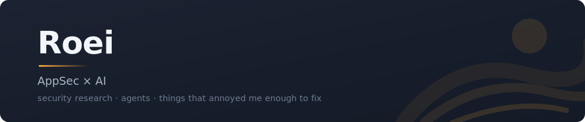

  

&nbsp;

Application security and AI, in production. Not a demo, not a notebook.

The platform I work on scans hundreds of thousands of repositories and absorbs tens of thousands
of events a day. Agents that reason about vulnerabilities instead of pattern-matching them, running
against real codebases, with a pager attached. The model was never the hard part. Git internals
were, and the 40 to 60x we clawed out of clone times to make any of it viable at that volume.

Before this: security research and reverse engineering, then a long stretch in automation.

Almost all of that lives in private repos, so this profile is the other half of the desk.
Mostly **Claude Code skills**, each written because something annoyed me exactly one time too many.

- [**human-comments**](https://github.com/roeibh/human-comments) teaches agents to stop writing essays in your source
- [**interactive-spec**](https://github.com/roeibh/interactive-spec) turns a spec into a clickable mockup that sends your comments back
- [**marp-deck-architect**](https://github.com/roeibh/marp-deck-architect) writes the deck, not just the theme
- [**interviewer-kit**](https://github.com/roeibh/interviewer-kit) turns a job description into an interview you can run twice
- [**morning-briefing**](https://github.com/roeibh/morning-briefing-claude-plugin) reads the inbox so I don't have to

Away from all that, [**check-please**](https://github.com/roeibh/check-please) opens your chess.com
games in Lichess's engine. No signup, no paywall, no server, because there is no backend at all.
**[Try it](https://roeibh.github.io/check-please/)**

> [!TIP]
> Install steps live in each repo, and they differ more than you would expect. Start there rather
> than guessing the path.
